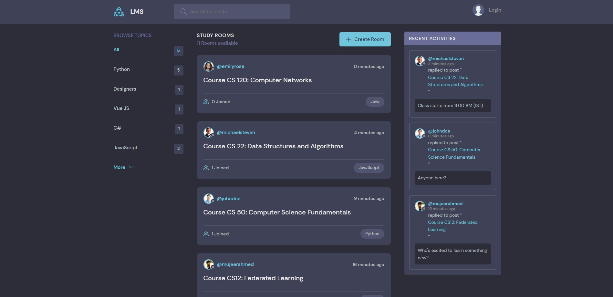
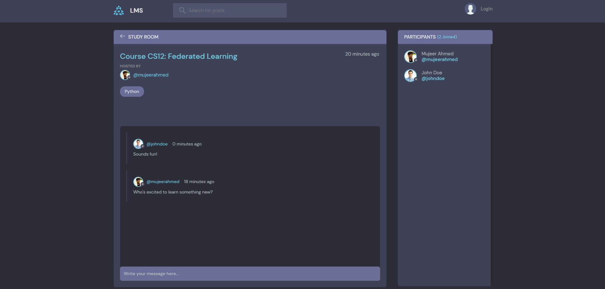
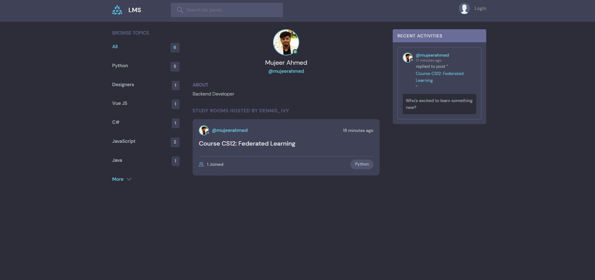

# Learning Managment System

</div>

### Cloning the repository

--> Clone the repository using the command below :

```bash
git clone https://github.com/mujeerahmed/lms

```

--> Move into the directory where we have the project files :

```bash
cd lms

```

--> Create a virtual environment :

```bash
# Let's install virtualenv first
pip install virtualenv

# Then we create our virtual environment
virtualenv envname

```

--> Activate the virtual environment :

```bash
envname\scripts\activate

```

--> Install the requirements :

```bash
pip install -r requirements.txt

```

#

### Running the App

--> To run the App, we use :

```bash
python manage.py runserver

```

> ⚠ Then, the development server will be started at http://127.0.0.1:8000/

#

### App Preview :

<table width="100%"> 
<tr>
<td width="50%">      
&nbsp; 
<br>
<p align="center">
  LMS Home
</p>

</td> 
<td width="50%">
<br>
<p align="center">
  Chatroom
</p>
  
</td>
<td width="50%">
<br>
<p align="center">
  Profile Info
</p>
  
</td>
</table>
